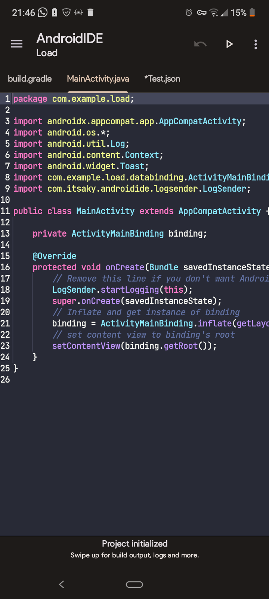
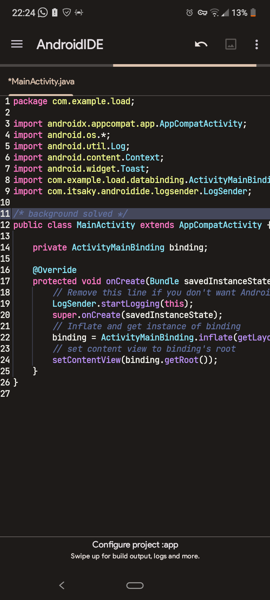

#  ♂️ Dracula theme for AndroidIDE
- This repository contains the Dracula theme source files for [AndroidIDE](https://github.com/AndroidIDEOfficial/AndroidIDE) 
---
- "dracula" version:
 

- "dracula(clean background)" version:


- How to apply it?
1. on your AndroidIDE, enter the terminal 
2. install git with the command:``` pkg i git -y```
3. with git installed, clone this repository with the command:``` git clone https://github.com/staricdev/dracula-androidide```
4. enter the folder with ```cd dracula-androidide```
5. choose which theme you want, done that use the command ``` mv <folder-name> $HOME/.androidide/ui/editor/schemes/```
6. exit the terminal with ```exit``` and restart AndroidIDE
7. go into settings -> Editor -> Schemes. the theme you chose should be there.
